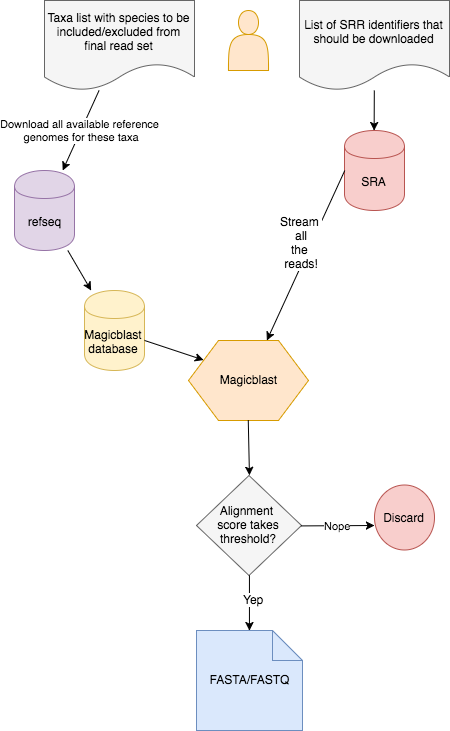

# Streaming SRA files and filtering them on the fly

## The Challenge
- The *SRA* is full of sequencing data. 🎉
- Tons of
  - sequencing platforms
  - experiment types (genomic, transcriptomic, metagenomic, younameit)
  - read qualities
- Great, lots of data to play around with, but…
    - often you don't want all the data from an experiment
        - saving 100s of read sets takes lots of space
        - files contain contaminants 😭
        - you only want individual genomes out of a metagenome
- The big question: How can we easily get only the interesting parts of *SRA* sets?

## Our solution
- Get reference genomes of interest or contaminants out of refseq to create a reference database
- Streaming the data right out of the *SRA* and use `magicblast` to compare to our reference database
- only save those reads you actually want!

